# Plant watering

A simple 1 main to multiple workers hardware setup to monitor soil moisture and water series of plant pots automatically.

Main device:
- Gateway of the setup, managing the workers, hosting web server for user interactions
- Monitoring water level from water container with capacitive sensor
- Controlling pump for watering

Worker device:
- Monitoring 1 or more soil moisture sensors and reporting to main
- Controlling 1 or more two-position three-way solenoid valves to redirect water to different plant pots

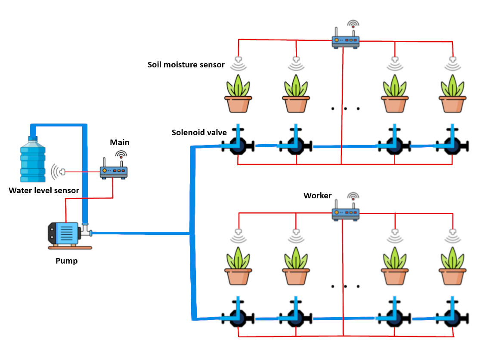

> **Disclaimer**: LLM has been used in this project as part of the learning process. On hardware side, Google Gemini, Claude AI, and OpenAI ChatGPT were used to explain usage of components, knowledge cross check, and parts recommendation. On software side, GitHub Copilot agent in Visual Studio Code was used to generate part of the code based on design document. Human review, revise, and test was conducted every round of generation.

## Design

- MCU:
    Considering the price and wireless requirement, ESP32 C3 was chosen.

- Power: 
    - Since main device will do the heavy duties(Always on, WiFi connection and web server host, pump driving, etc.), a 12V DC input using common DC barrel plug adapter was used to provide continuous power. 
    - Amount of workers can be scaled up and locations varies based on the plant location, while worker can be less power hungry, rechargeable LiPo battery is used.

- Communication:
    - Bluetooth between main and worker for sensor reading reporting and watering command sending. 
    - For easy scalability and setup process, all devices use BLE broadcast to send messages and filter message by MAC address of sendor, no connection is required.

- Function:
    - Users add workers to main by Bluetooth MAC address. Main will probe added workers and learn details upon first status report(worker having 1/8/16 ports available)
    - Users set watering duration, soil moisture threshold, and automatic watering interval for each plant pot, plus the system-wide active time range and data-sync interval.
    - After enabling auto watering, main collects sensor readings, starts pump and commands workers to trigger solenoid valve, then let workers go to deep sleep mode during time interval to save power.
    - Solenoid valve will be triggered one by one, meaning only one pot will be watered at a single time, due to battery current and pump power limitation.

## Hardware

### V1

For the initial idea, because of the nature of similarity between main and worker(1 sensor, 1 peripheral), it was decided to use a single PCB design for both devices with compatibility added to fit different parts on the same board. 

Since a 12V pump was used, a 12V solenoid valve was also chosen. Then all differences are as follow:
- Different sockets for pump(screw terminal) and valve(GH 1.25 socket), lined up next to each other on the PCB, use one of them as needed.
- Different sensor pin numbers(3 pins for soil moisture and 4 pins for water level), since both are XH 2.54, and both have pin 3 as data output, put a single 4 pin footprint, and use different parts.
- Different VIN and GND pin sequences for sensors, use two 0 ohm with solder pads in 2*2 grid to bridge trace to achieve different sequences on different orientations.

Being first version of the project and first personal hardware project, this one has severe design flaws due to lacking of knowledge, hardware understanding, and product reasearch. It was scrapped later.

#### Shared Schematic & PCB

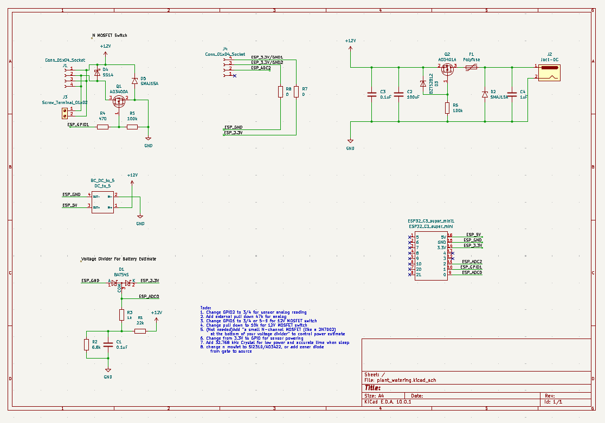

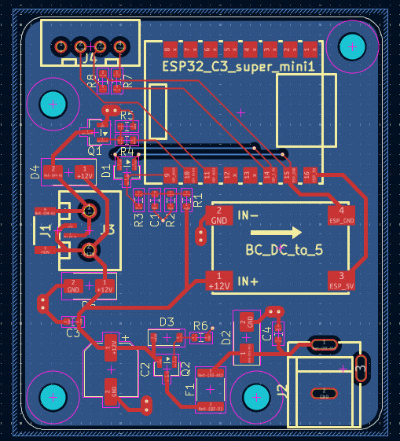

#### Main

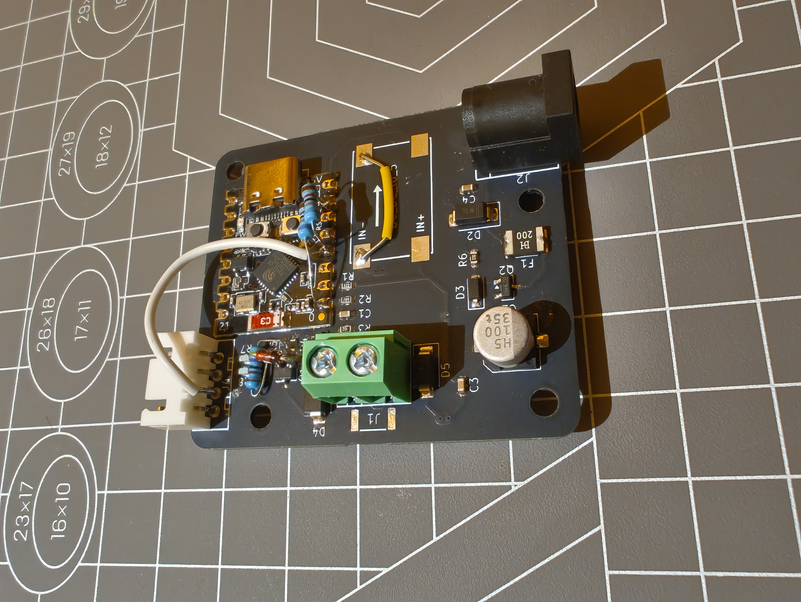

#### Worker

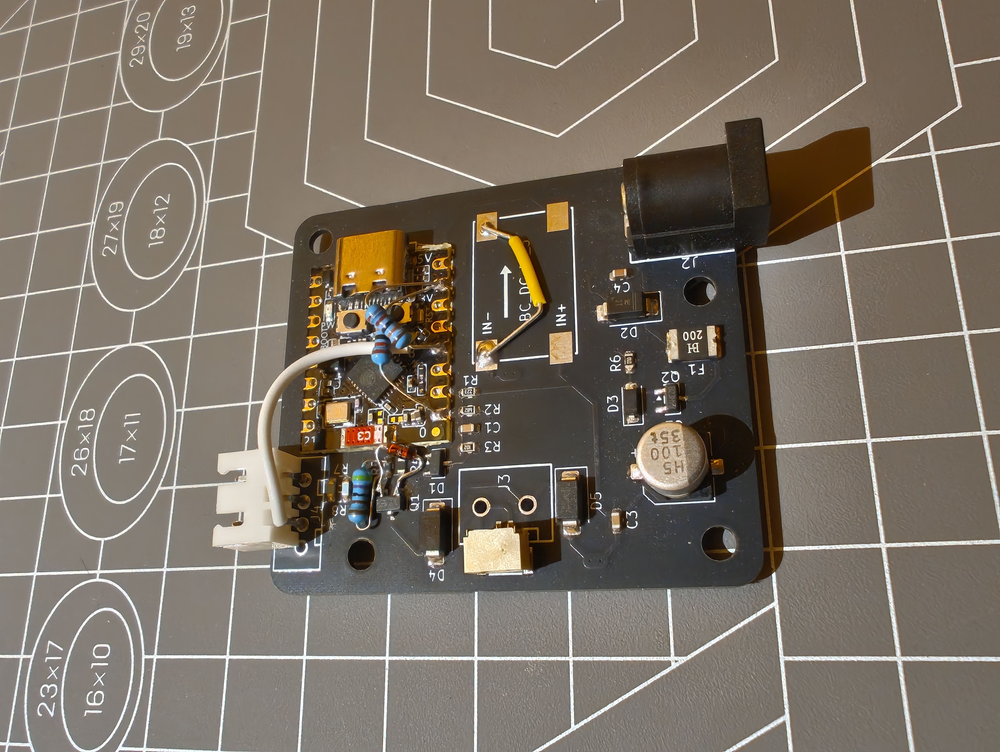

### V2

Design of main device is basically V1, but with dimension changed to fit case and worker compatibility removed, as worker is fully redesigned.

For worker, after reviewing the total cost of V1 worker, it was really expensive for users owning dozens of pots of plant. In V2, worker had numbers of monitored plant expand from 1 to 8, and can be expanded to 16 in the future.

To reduce cost and weight, power was cut from 12V to 5V. Battery was moved from large lithium battery pack to flat LiPo with charging & 5V boost converter module. Solenoid valve was also changed to a different 5V version.

There are still several minor issues with this version, not function breaking, but are documented in the schematic and shall be fixed in the next revision.

#### Main

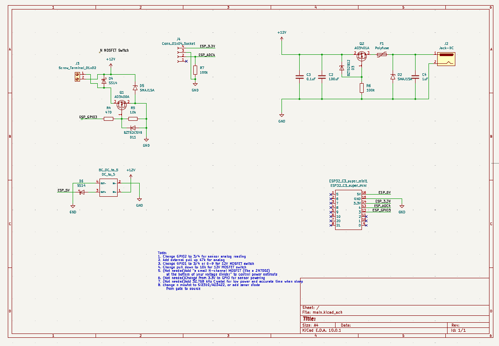

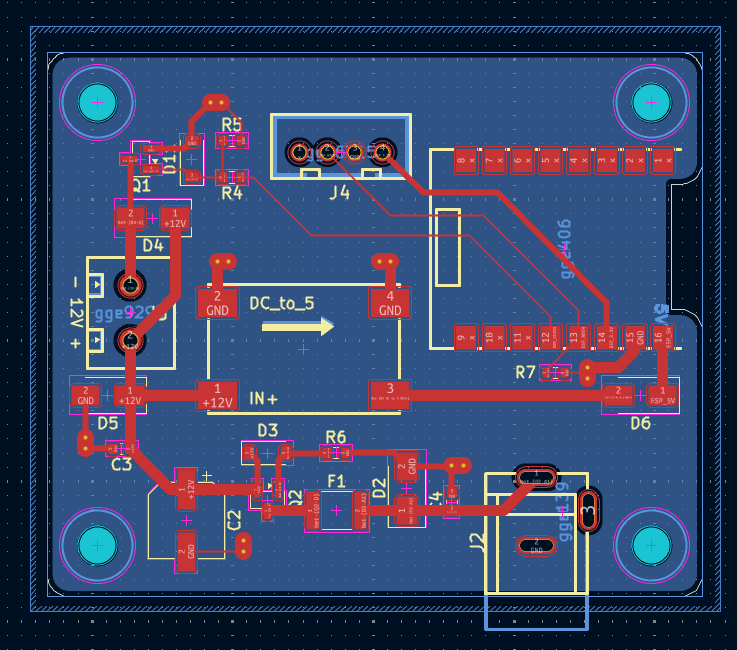

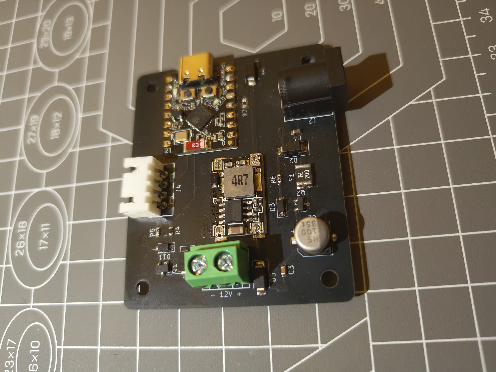

#### Worker

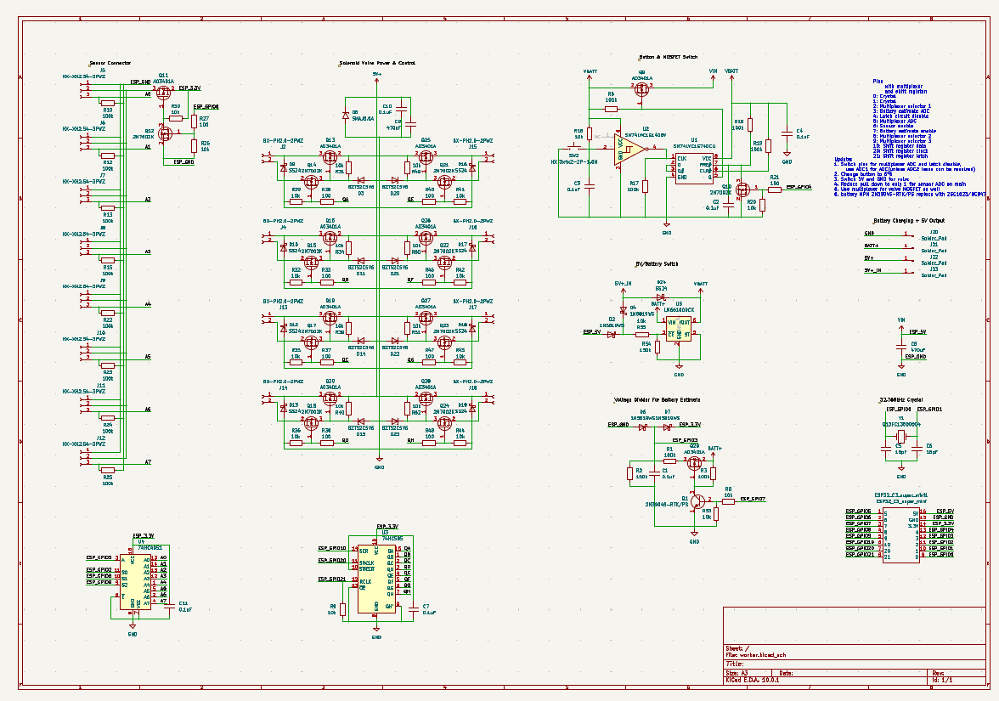

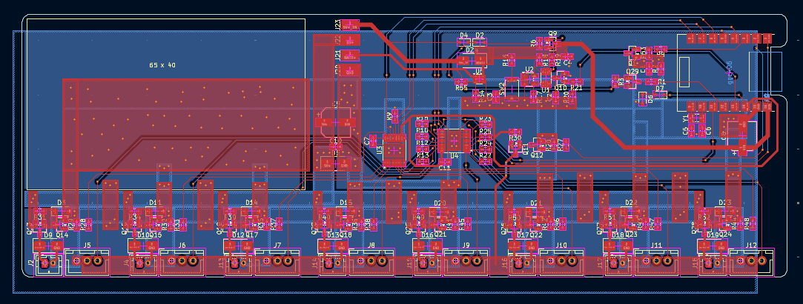

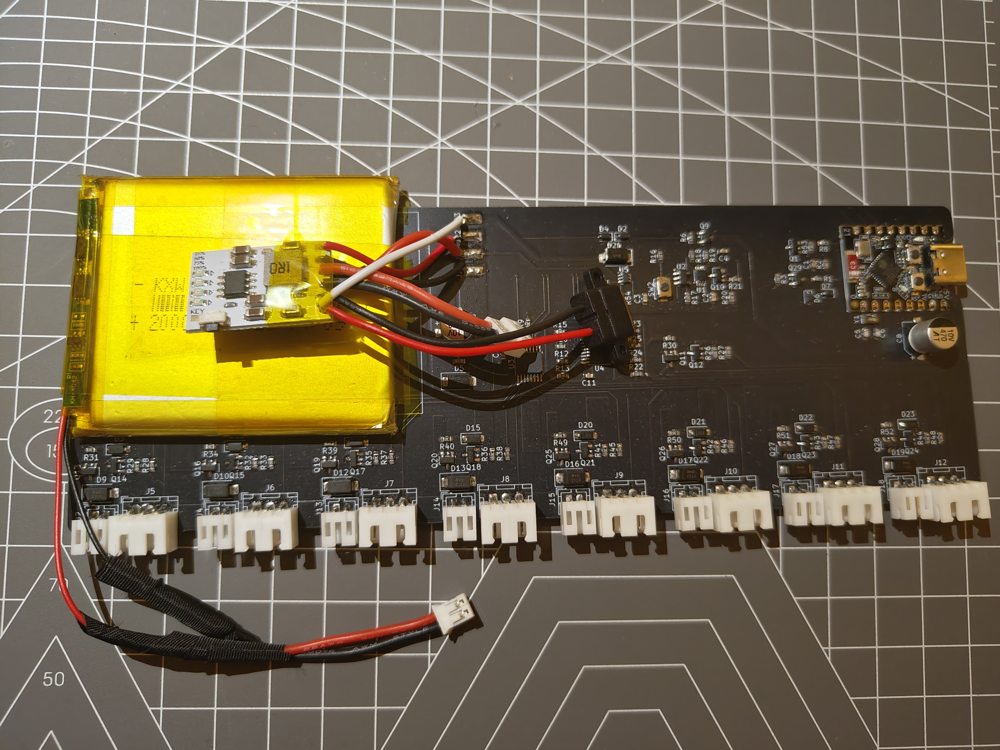

